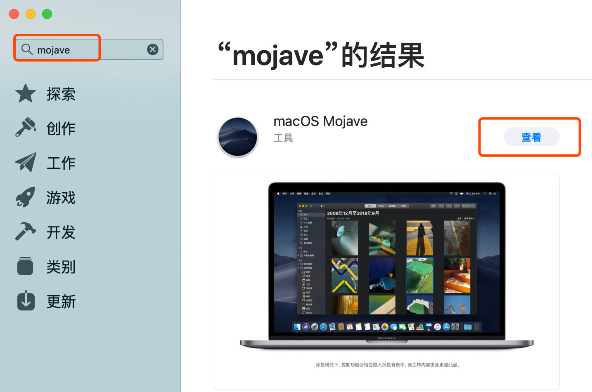
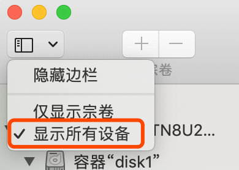
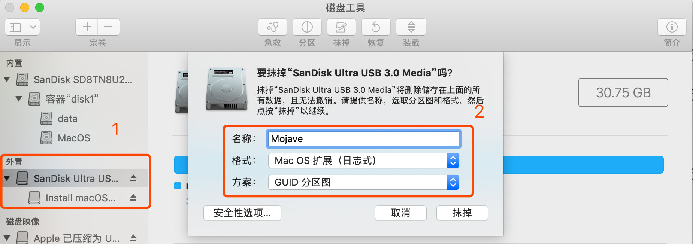
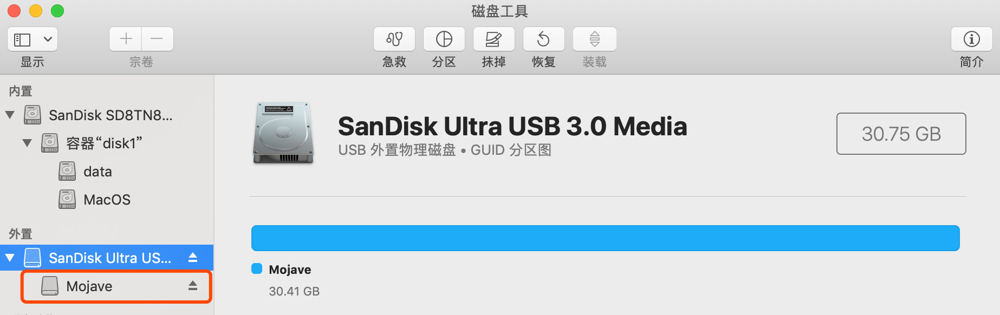
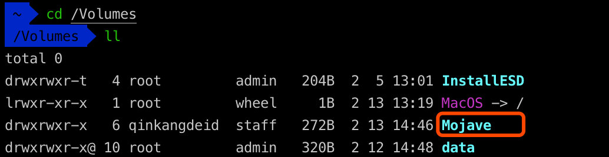
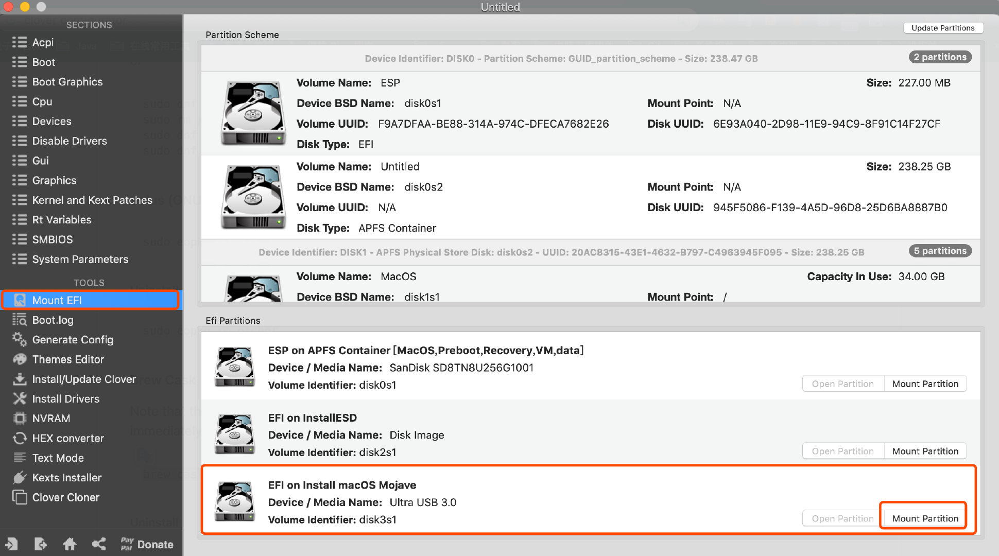
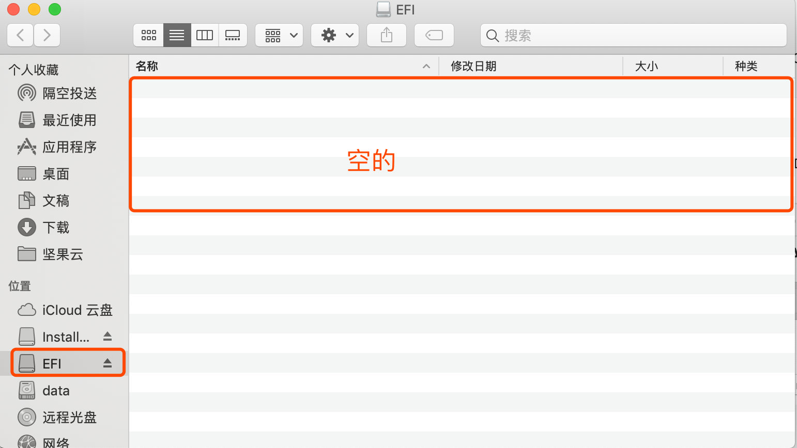
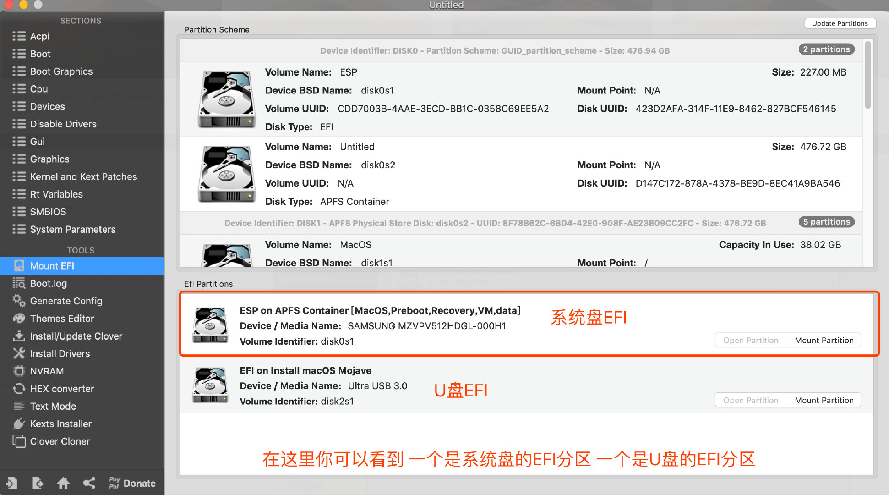

# Hackintosh for deskmini 310

## 一、配置规格
| 类别 | 型号 |
| ---- | ---- |
| CPU  |   i7-8700   |
| 内存 |威刚 2400 16GB * 2    |
| 硬盘 |  西数sn750 1T    |
| 网卡 | dw 1830    |
| 准系统| Deskmini 310 |

## 二、制作黑苹果启动U盘

### 1、前期准备

- 8GB以上U盘(空盘、有数据的提前备份，制作时会格式化)
- Mac镜像(在Mac环境AppStore下载或网上找网友分享的镜像)
- 符合你PC配置的EFI引导文件

### 2、Apple store下载原版镜像

`如果你已经有Mac环境了(实体机或者虚拟机)`，直接去App Store搜索系统版本名称下载镜像，例如现在最新版本是Mojave



镜像很大，下载需要时间，下载完成后会在`启动台`里看到镜像


格式化U盘

> 镜像已经准备完毕，下面就是制作U盘启动了

将要用于制作启动盘的U盘插入USB上，打开 `应用程序 → 实用工具 → 磁盘工具`，将U盘`抹掉`(格式化) 成`Mac OS X 扩展（日志式）`格式、`GUID 分区图`，并将 U 盘命名为`Mojave`

**注意 **：这里的盘符名称你可以随意指定，但是下一步制作U盘启动的时候选择的U盘名称要和这里设置的一样。



此时可以看到你的U盘名称变成了`Mojave`


你也可以去`Volumes`下面查看U盘名称

打开 应用程序→实用工具→终端(或者使用你喜欢的任何一个终端工具)，将下面的一段命令复制并粘贴进去： 如要制作 MacOS Mojave 启动盘，然后输入下面这段命令：

此命令需要输入管理员密码

```shell
sudo /Applications/Install\ macOS\ Mojave.app/Contents/Resources/createinstallmedia --volume /Volumes/Mojave /Applications/Install\ macOS\ Mojave.app --nointeraction
```
回车操作后，便已经在制作中了.耐心等待，这个时间持续比较久


完整的制作日志如下：
```shell
 ~ sudo /Applications/Install\ macOS\ Mojave.app/Contents/Resources/createinstallmedia --volume /Volumes/Mojave /Applications/Install\ macOS\ Mojave.app --nointeraction
Password:
Erasing disk: 0%... 10%... 20%... 30%... 100%
Copying to disk: 0%... 10%... 20%... 30%... 40%... 50%... 60%... 70%... 80%... 90%... 100%
Making disk bootable...
Copying boot files...
Install media now available at "/Volumes/Install macOS Mojave"
```
到这里U盘启动制作完毕。

## 三、复制EFI引导文件
如果是在Mac环境下，我使用Clover Configurator软件挂载，毕竟以后黑苹果要改配置都用得上它。软件下载可以去这里下载,不是 Mac App Store下载的软件，MacOS会启用了新的安全机制检查不让运行，命令行执行sudo spctl --master-disable命令即可运行。

打开了Clover Configurator软件后，切到Mount EFI标签，找到你的U盘名字，点击Mount Partition输入用户密码挂载EFI分区。


挂载之后在访达可以看到盘符，现在这个盘符里面内容是空的，什么也没有

把你准备好的EFI文件复制到刚才挂载的U盘的EFI分区即可，注意一定要带EFI文件夹名称


## 四、BIOS设置

BIOS设置（bios版本v3.1,升级3.4可能会装不上！）:

1. Load UEFI Defaults
2. Advanced
   - Onboard HD Audio: Enabled
   - USB Configuration, XHCI Hand-off, Enabled
   - Super IO Configuration, Serial Port, Disabled（必须）
3. Security Secure Boot, Disabled(by default)
4. CSM打开 ，仅UEFI

## 五、安装MacOS系统

### 1、U盘启动

到这一步，假设你已经做好了U盘启动器了。现在万事俱备，只差实施了。

- 选择U盘启动

  将你制作好的U盘启动器插入到你将要安装系统的机器的USB口上，将机器开机，查找你主板的`Boot Menu`快捷键（一般都是F11或者F12，华擎主板的是按F12），进入到启动选择界面，找到你的U盘启动器的名字，选择它的UEFI启动，例如我的U盘的名字是`SanDisk`，则我就选择`UEFI`那个分区启动，如果你的U盘品牌不一样，请找到你的U盘并且对号入座选择正确的启动项：

- Clover引导界面选择安装
  - 弹出抹盘的选项，系统盘符名称可以随便填写，我这填`MacOS`抹盘格式选择`MacOS拓展（日志式）`，之后点击`抹掉`按钮
  - 之后会出现安装进度条，在这个阶段机器会**重启若干次**，所以你要仔细盯着屏幕了，等机器重启的时候你要像之前那样，**手动选择以U盘启动器方式启动**，不然进不到下面的步骤，谨记，如果你晃了神，没能及时选择U盘启动，那么重新关机，再开机选择一次，安装进度也能继续进行。
  - 当你的机器再次重启的时候，在Clover的引导界面会多出一个选项，这个选项就是我们刚才安装的系统盘，这一次选择启动到我们的系统盘
- 这个步骤可能还是会有重启，所以和之前上面的操作一样，手动选择U盘启动器，clover引导界面选择启动到我们的系统盘，大概十几分钟后安装完毕会提示下面即将要重启的提示，记住，**只要重启，你就要手动选择U盘启动，现在的引导文件只在我们的U盘启动器里面，还没有在我们的系统盘里面，所以要引导系统，就需要选择U盘引导启动**。
  
### 2、复制EFI引导到系统盘
神功虽练成，但是你还是需要使用外部的U盘来进行引导系统的启动，所以下面，你需要将引导文件装载到你系统盘的EFI分区，到了这一步我已经明确知道你已经拥有MacOS环境了，那么就使用`Clover Configurator`软件挂载吧，这个步骤和制作U盘启动器时候把EFI文件复制进U盘里的步骤是一样样的，只不过这一次你是要把EFI文件复制到你已经安装好的系统盘的EFI分区里而已。为了你不用回去看步骤，我还是复制以前的放这里吧，连贯一些

软件下载可以去这里[下载](https://mackie100projects.altervista.org/download-clover-configurator/),不是 **Mac App Store**下载的软件，MacOS会启用了新的安全机制检查不让运行，命令行执行`sudo spctl --master-disable`命令即可运行。

打开了`Clover Configurator`软件后，切到`Mount EFI`标签，这里会显示两个EFI分区，分别给两个分区都挂载到系统上，点击`Mount Partition`输入用户密码挂载EFI分区。

这个时候分别打开系统盘的EFI和U盘的EFI分区，将U盘EFI分区里的`EFI文件夹`整个复制到系统盘的EFI分区里就搞定了！这回神功就附体了！




相关文档：

[Asrock deskmini 310-com hackintosh 10.14 EFI](https://blog.xjn819.com/?p=7)

[z370n-wifi-hackintosh](https://github.com/qinkangdeid/z370n-wifi-hackintosh)


